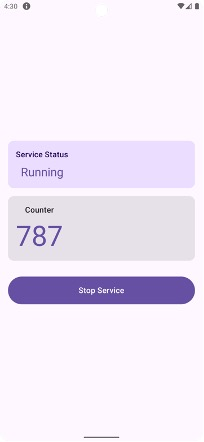
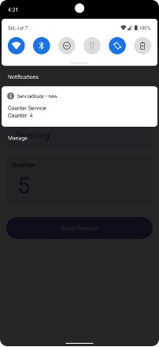
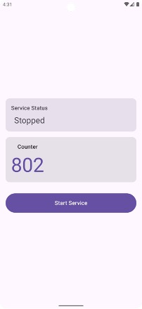

# ServiceStudy - Android Foreground Service Counter App

<div align="center">


*A modern Android application demonstrating foreground service implementation with real-time counter functionality*

[Features](#features) • [Screenshots](#screenshots) • [Installation](#installation) • [Usage](#usage) • [Architecture](#architecture)

</div>

## ✨ Features

- 🎯 **Foreground Service**: Persistent background counting with system notification
- 🚀 **Real-time Updates**: Live counter synchronization between service and UI
- 🎨 **Modern UI**: Built with Jetpack Compose and Material3 design
- 📱 **Responsive Design**: Adaptive layouts with dynamic color schemes
- 🔄 **State Management**: Reactive programming with StateFlow and ViewModel
- 🛡️ **Memory Safe**: Proper lifecycle management and resource cleanup
- 📻 **Broadcast Communication**: Efficient service-to-UI data transmission
- 🔔 **Notification Integration**: Persistent notification with counter display

## 📱 Screenshots

<div align="center">
<table>
<tr>
<td align="center">

<br>
<sub><b>App Launch Screen</b></sub>
</td>
<td align="center">

<br>
<sub><b>Service Running</b></sub>
</td>
<td align="center">

<br>
<sub><b>Service Stopped State</b></sub>
</td>
</tr>
</table>
</div>

## 🚀 Installation

### Prerequisites

- Android Studio Arctic Fox or newer
- Android SDK API 24+
- Kotlin 1.9.0+

### Clone and Build

```bash
# Clone the repository
git clone https://github.com/yourusername/ServiceStudy.git

# Navigate to project directory
cd ServiceStudy

# Open in Android Studio
# File -> Open -> Select ServiceStudy folder

# Build and run
# Click Run button or use Ctrl+R (Cmd+R on Mac)
```

### APK Download

Download the latest APK from [Releases](https://github.com/yourusername/ServiceStudy/releases)

## 📖 Usage

1. **Launch the App**: Open ServiceStudy on your Android device
2. **Start Service**: Tap "Start Service" button to begin the counter
3. **View Progress**: Watch the real-time counter updates in both app and notification
4. **Background Operation**: Switch to other apps - the counter continues running
5. **Stop Service**: Return to app and tap "Stop Service" to halt the counter

### Service States

| State | UI Indicator | Notification | Description |
|-------|-------------|--------------|-------------|
| **Stopped** | Gray card, "Stopped" text | None | Service is inactive |
| **Running** | Blue card, "Running" text | Counter notification | Service actively counting |

## 🏗️ Architecture

### Tech Stack

- **Language**: Kotlin 100%
- **UI Framework**: Jetpack Compose + Material3
- **Architecture**: MVVM (Model-View-ViewModel)
- **Dependency Injection**: Android Hilt (optional)
- **Async Programming**: Kotlin Coroutines
- **State Management**: StateFlow + Compose State

### Project Structure

```
app/src/main/java/com/oboard/servicestudy/
├── MainActivity.kt           # Main activity with Compose UI
├── MainScreen.kt            # Compose UI screens
├── MainViewModel.kt         # ViewModel for state management
├── CounterService.kt        # Foreground service implementation
└── ui/theme/               # Material3 theme configuration
```

### Key Components

#### 🔧 CounterService
```kotlin
class CounterService : Service() {
    // Foreground service with coroutine-based counter
    // Handles notification creation and broadcast updates
}
```

#### 🎯 MainViewModel
```kotlin
class MainViewModel : AndroidViewModel {
    // StateFlow-based state management
    // BroadcastReceiver for service communication
    // Service control methods
}
```

#### 🎨 MainScreen
```kotlin
@Composable
fun MainScreen() {
    // Material3 UI components
    // Reactive state binding
    // Dynamic color schemes
}
```

## 🔧 Configuration

### Permissions Required

```xml
<uses-permission android:name="android.permission.FOREGROUND_SERVICE" />
<uses-permission android:name="android.permission.POST_NOTIFICATIONS" />
```

### Service Declaration

```xml
<service
    android:name=".CounterService"
    android:enabled="true"
    android:exported="false"
    android:foregroundServiceType="dataSync" />
```

## 🛠️ Development

### Dependencies

```kotlin
// Core Android
implementation("androidx.core:core-ktx:1.16.0")
implementation("androidx.lifecycle:lifecycle-runtime-ktx:2.9.0")

// Jetpack Compose
implementation("androidx.activity:activity-compose:1.10.1")
implementation("androidx.compose.material3:material3")
implementation("androidx.lifecycle:lifecycle-viewmodel-compose:2.7.0")

// Coroutines
implementation("org.jetbrains.kotlinx:kotlinx-coroutines-android:1.7.3")
```

### Building from Source

```bash
# Debug build
./gradlew assembleDebug

# Release build
./gradlew assembleRelease

# Run tests
./gradlew test

# Generate APK
./gradlew packageRelease
```

## 🧪 Testing

```bash
# Unit tests
./gradlew testDebugUnitTest

# Instrumented tests
./gradlew connectedAndroidTest

# Test coverage
./gradlew jacocoTestReport
```

## 🤝 Contributing

We welcome contributions! Please see our [Contributing Guidelines](CONTRIBUTING.md) for details.

### Development Workflow

1. Fork the repository
2. Create a feature branch (`git checkout -b feature/amazing-feature`)
3. Commit your changes (`git commit -m 'Add amazing feature'`)
4. Push to the branch (`git push origin feature/amazing-feature`)
5. Open a Pull Request

### Code Style

- Follow [Kotlin Coding Conventions](https://kotlinlang.org/docs/coding-conventions.html)
- Use meaningful variable and function names
- Add comments for complex logic
- Ensure proper error handling

## 📋 Roadmap

- [ ] Add pause/resume functionality
- [ ] Implement custom counter intervals
- [ ] Add sound notifications
- [ ] Support for multiple counters
- [ ] Dark/Light theme toggle
- [ ] Export counter data
- [ ] Widget support

## 🐛 Known Issues

- Notification may not appear on some MIUI devices (workaround: enable auto-start)
- Counter resets on app force-stop (expected behavior)

## 📄 License

This project is licensed under the MIT License - see the [LICENSE](LICENSE) file for details.

## 👨‍💻 Author

**oboard**
- GitHub: [@oboard](https://github.com/oboard)
- Email: oboard@outlook.com

## 🙏 Acknowledgments

- [Android Developers Documentation](https://developer.android.com/)
- [Jetpack Compose Samples](https://github.com/android/compose-samples)
- [Material Design Guidelines](https://material.io/design)

## ⭐ Star History

[](https://star-history.com/#yourusername/ServiceStudy&Date)

---

<div align="center">

**[⬆ Back to Top](#serviceStudy---android-foreground-service-counter-app)**

Made with ❤️ for the Android community

</div> 